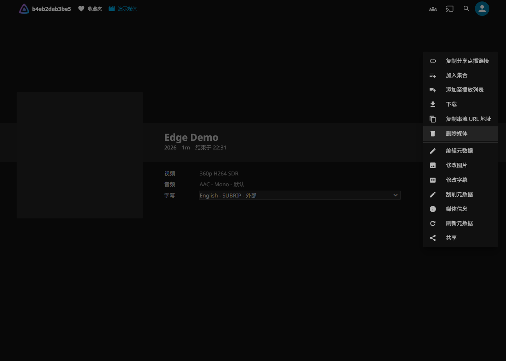
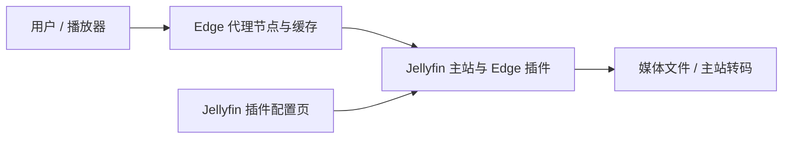

# Jellyfin Edge

让 Jellyfin 通过代理节点缓存和分发媒体，并从网页菜单生成无需登录的分享链接。配置集中在 Jellyfin 插件页面；代理节点自动注册，无需共享挂载媒体目录。

## 支持的功能

- **原文件缓存**：直接播放、下载按需分块缓存，支持 Range、容量限制和 LRU 淘汰。
- **分享点播**：主站生成 HLS，代理缓存并分发；可选择音轨、烘焙字幕和设置输出质量。
- **下载与串流链接**：使用绑定媒体、版本、节点和操作的凭证，不向观众暴露 Jellyfin 登录 token。
- **节点管理**：发现、启用、缓存设置、清空缓存和指定默认节点。
- **链接管理**：默认有效期 7 天，可设置不过期；分页查看和批量撤销。

在视频详情页选择媒体版本、音轨和字幕，然后打开“更多”菜单。分享使用当前选择；下载和复制串流保持原文件输出。分享创建要求播放权限，下载和原文件串流要求下载权限。

## 如何工作

Jellyfin 主站负责账号权限、媒体读取和转码。代理节点缓存原文件块及分享转码分片，向用户提供内容；普通播放转码继续由主站处理。节点定期同步配置与授权。

## 安装与部署

1. Jellyfin 后台进入“插件 → 仓库”，添加 [Jellyfin Edge 插件目录](https://raw.githubusercontent.com/LxFee/jellyfin-edge/plugin-repository/manifest.json)，然后在插件目录安装并重启。也可从 [Releases](https://github.com/LxFee/jellyfin-edge/releases) 下载 ZIP 手动安装。
2. 在插件配置页生成注册 token，将它保存为代理节点的私有文件。
3. 使用 [GHCR 代理镜像](https://github.com/LxFee/jellyfin-edge/pkgs/container/jellyfin-edge-gateway) 部署节点，填写主站地址、注册文件和持久状态目录。
4. 刷新节点列表，填写节点公开 URL、缓存容量，启用节点并设置默认节点。

已有 Jellyfin 可以只安装插件；新部署也可使用 [GHCR 主站镜像](https://github.com/LxFee/jellyfin-edge/pkgs/container/jellyfin-edge-host)，其中包含 Edge 插件。版本镜像与 Release 同步发布，部署示例见 [部署指南](docs/setup.md)，字段含义见 [插件设置说明](docs/plugin-settings.md)。

## 兼容范围

当前发布针对 **Jellyfin Server / Web 12.2、.NET 10、Linux amd64 镜像**。网页菜单通过 Jellyfin Web 12.2 的页面结构接入，升级 Server 或 Web 前应核对支持版本。其他版本、移动端全部菜单及第三方原生客户端的导出界面未经过完整验证。

分享输出支持 HLS / MPEG-TS，默认 H.264 + AAC，也可选择 HEVC 或原文件；播放器需支持所选格式。完整缓存的导出可在主站离线时继续读取，缺失内容仍需回源；离线节点无法即时获知撤销。详见 [兼容与验证范围](docs/validation.md)。

## 更多说明

- [插件设置](docs/plugin-settings.md)：注册、节点、缓存、输出质量和链接管理，附示例截图。
- [设计取舍](docs/design.md)：缓存范围、主站转码、授权与离线行为。
- [部署指南](docs/setup.md)：插件目录、手动安装、Docker Compose 与反向代理。
- [开发与发布](docs/development.md)：构建、测试、Release 与镜像发布。

分享点播方案参考 [Jellyfin VRC Relay](https://github.com/Tokiichika/jellyfin-vrc-relay)，感谢其公开实现。项目自有代码使用 [MIT License](LICENSE)，参考项目与依赖许可见 [第三方说明](THIRD_PARTY_NOTICES.md)。
