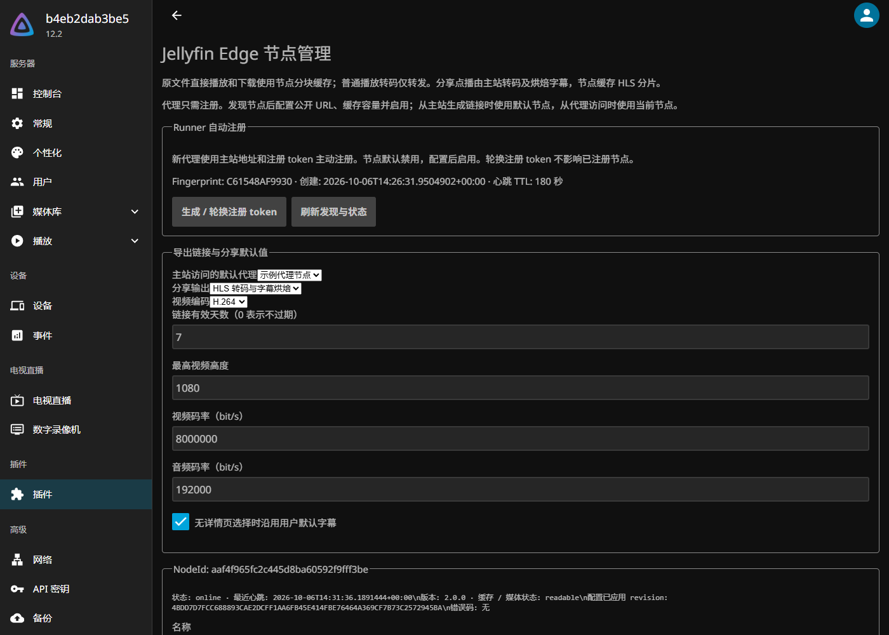
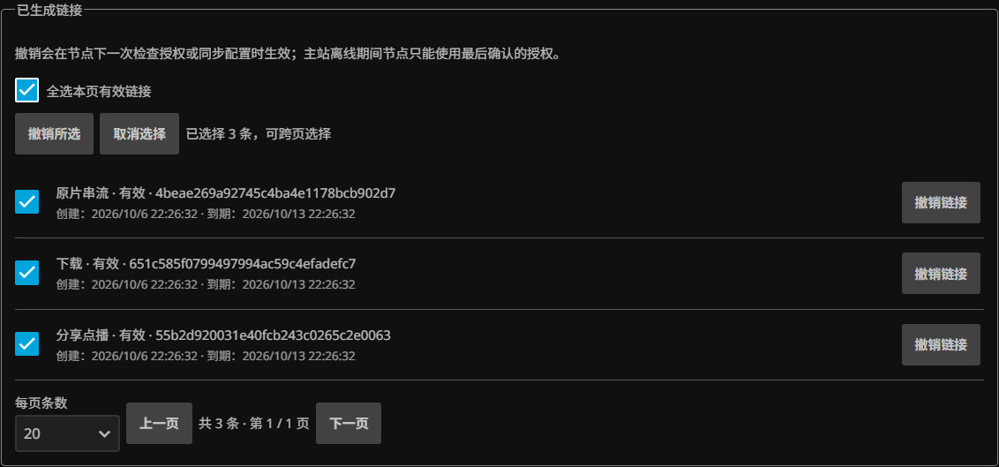

# 插件设置说明

后台进入“插件 → Jellyfin Edge”打开配置页。截图来自隔离演示环境，媒体、节点名称和地址均为示例；注册 token 不出现在截图中。

## 注册节点

点击“生成 / 轮换注册 token”，将显示的 token 保存到代理节点的私有注册文件，配置 `EDGE_ENROLLMENT_TOKEN_FILE`。新节点会主动注册，默认禁用；点击“刷新发现与状态”查看。轮换注册 token 仅影响后续注册，已注册节点继续使用持久身份。

注册 token 不放入 Compose、仓库或公开截图。主站与节点之间需要可达的受控网络，公开入口采用 HTTPS；具体步骤见[部署指南](setup.md)。

## 导出链接与分享默认值

| 设置 | 默认值 | 含义 |
|---|---|---|
| 链接有效期 | 7 天 | `0` 表示不过期，作用于新生成的链接 |
| 分享输出 | HLS | 可选择转码点播或原文件 |
| 视频编码 | H.264 | 可选 HEVC；取决于播放器与主站编码能力 |
| 最高高度 | 1080 | 转码输出最高分辨率，单位像素 |
| 视频码率 | 8,000,000 | 单位 bit/s |
| 音频码率 | 192,000 | 单位 bit/s，默认 AAC，至多双声道 |
| 默认字幕 | 开启 | 缺少页面选择时采用默认轨道策略 |

视频详情页上的媒体版本、音轨和字幕选择优先用于该次分享。明确关闭字幕会被保留；选择的字幕由主站烘焙进分享视频。下载与原文件串流保持原文件语义。[分享输出契约](vod-output.md)

## 节点设置

| 设置 | 默认值 | 含义 |
|---|---|---|
| 启用 | 关闭 | 注册后由管理员确认启用 |
| 公开 URL | 空 | 用户访问该节点的完整入口，可含 BaseUrl |
| 默认节点 | 未选 | 从主站生成导出链接时使用；经代理访问时使用当前节点 |
| 启用缓存 | 开启 | 缓存原文件块与分享分片 |
| 缓存容量 | 50 GiB | 到达容量后按 LRU 淘汰 |
| 块大小 | 2 MiB | 原文件按该大小填充，改变后应清空旧缓存 |
| 信任代理头 | 关闭 | 仅在受控反向代理已清理外部转发头时开启 |

配置后点击“保存配置”。节点默认每 60 秒同步，清空缓存指令也在下次同步时执行。缓存目录应保留在持久卷中。节点不需要挂载主站媒体目录。

## 链接管理

列表按最新生成顺序显示，默认每页 20 条，可切换 50 或 100。可跨页勾选后“撤销所选”，也可撤销单条。列表不展示原始 token 或媒体文件路径。

撤销在节点下一次同步或检查授权时生效。主站离线期间，节点只能依据最后确认的授权读取完整缓存，无法即时收到撤销。[导出链接边界](exported-links.md)
