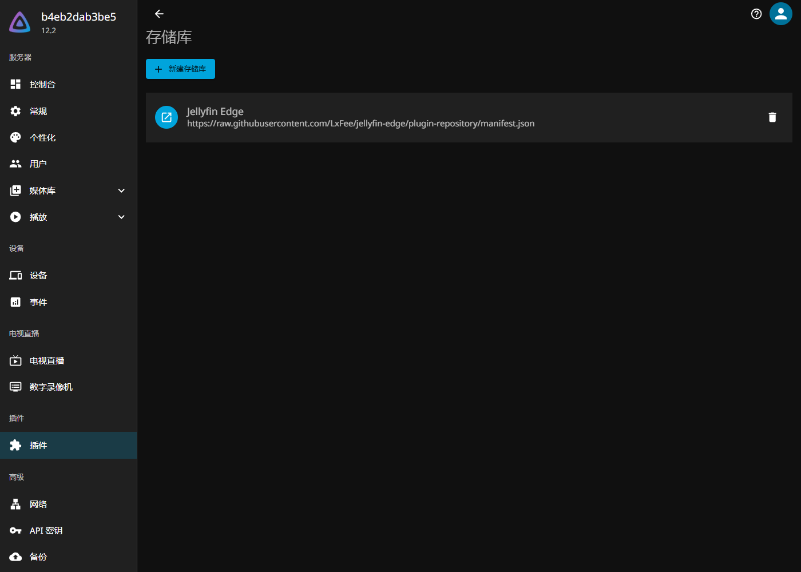
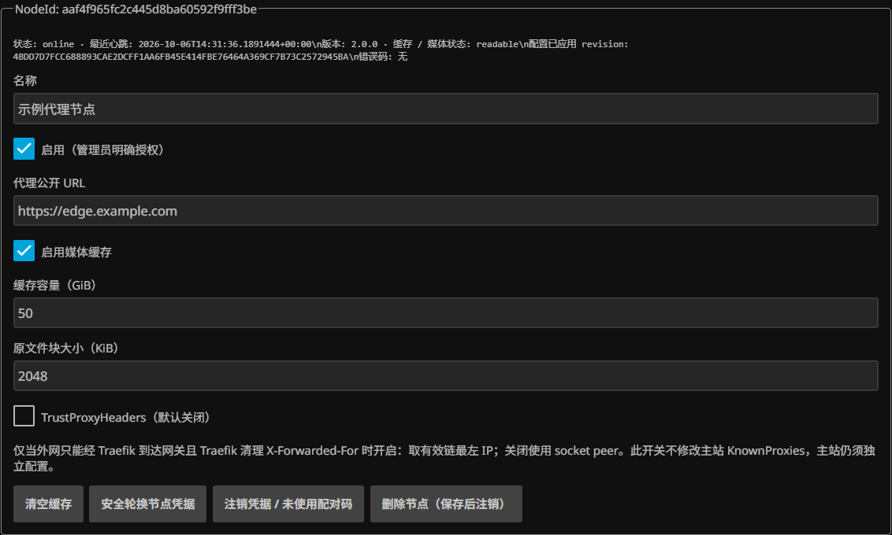

# 安装与部署

已有 Jellyfin Server / Web 12.2 可安装插件后单独部署代理；新部署可使用包含 Edge 插件的主站镜像。镜像支持 Linux amd64，固定版本标签与 Release 一致。

## 安装插件

在后台“插件 → 仓库”添加名称 `Jellyfin Edge`，地址为：

```text
https://raw.githubusercontent.com/LxFee/jellyfin-edge/plugin-repository/manifest.json
```

进入插件目录，安装 Jellyfin Edge 后重启。手动安装时，从 [Release](https://github.com/LxFee/jellyfin-edge/releases) 下载 `Jellyfin.Edge_2.0.0.0.zip`，核对同页 `SHA256SUMS`，解压到主站数据目录的 `plugins/Jellyfin Edge_2.0.0.0/`，然后重启。手动升级移走旧版 Edge DLL，保留 `plugins/configurations/` 中配置和私有状态。



## 已有主站：部署代理

1. 打开插件配置页，生成注册 token。
2. 在代理服务器保存 token，不写入 YAML。下面的命令会隐藏输入：

```bash
mkdir -p secrets state
chmod 700 secrets
read -rsp 'Enrollment token: ' EDGE_TOKEN; printf '\n'
printf '%s' "$EDGE_TOKEN" > secrets/enrollment
unset EDGE_TOKEN
sudo chown 10001:10001 secrets/enrollment state
sudo chmod 400 secrets/enrollment
sudo chmod 700 state
export EDGE_ENROLLMENT_FILE="$PWD/secrets/enrollment"
export EDGE_STATE_DIR="$PWD/state"
export JELLYFIN_BACKEND=https://jellyfin.example.com
docker compose -f deploy/compose.gateway.yml up -d
```

代理通过 `JELLYFIN_BACKEND` 访问主站，并保留持久状态与缓存目录；只需注册 token 文件，不需要媒体挂载。状态目录由容器 UID 10001 写入。首次注册成功后，身份保存到状态文件，后续启动使用该身份。

## 新主站：部署主站与代理

先设置媒体目录并启动主站，完成 Jellyfin 初始化：

```bash
export MEDIA_DIR=/srv/media
export EDGE_ENROLLMENT_FILE="$PWD/secrets/enrollment"
export EDGE_STATE_DIR="$PWD/state"
docker compose -f deploy/compose.yml up -d host
```

从插件页取得注册 token，按上面的文件权限步骤保存，再启动代理：

```bash
docker compose -f deploy/compose.yml up -d gateway
```

本机入口为主站 `http://127.0.0.1:8096`、代理 `http://127.0.0.1:8080`。远程部署在节点服务器分别使用主站镜像和代理模板，并将 `JELLYFIN_BACKEND` 设为可达的主站入口。

## 公开入口与启用节点

用反向代理将 `https://jellyfin.example.com` 转发到主站，`https://edge.example.com` 转发到代理，保留查询参数、Range 与 WebSocket Upgrade。模板的端口默认仅监听回环地址；容器化入口可以改用共享 Docker 网络连接服务。需要 BaseUrl 时，在主站和公开入口使用一致路径。

在插件页刷新发现，填写代理公开 URL，选择缓存容量并启用，设置默认节点后保存。节点默认每 60 秒同步配置。确认状态在线后，从代理入口登录并生成分享链接。



“信任代理头”默认关闭；只有入口清理外部转发头，且主站 KnownProxies 包含实际代理出口时才开启。沿用原生 WebSocket 转发的部署确认变量见[协议](protocol.md)。设置字段与链接撤销见[插件设置说明](plugin-settings.md)。

## 更新

从 Release 核对兼容范围，更新 Compose 镜像版本标签，然后执行 `docker compose pull` 与 `docker compose up -d`。保留主站配置、节点状态和缓存目录。使用官方主站加插件时，从插件目录更新并重启主站。
